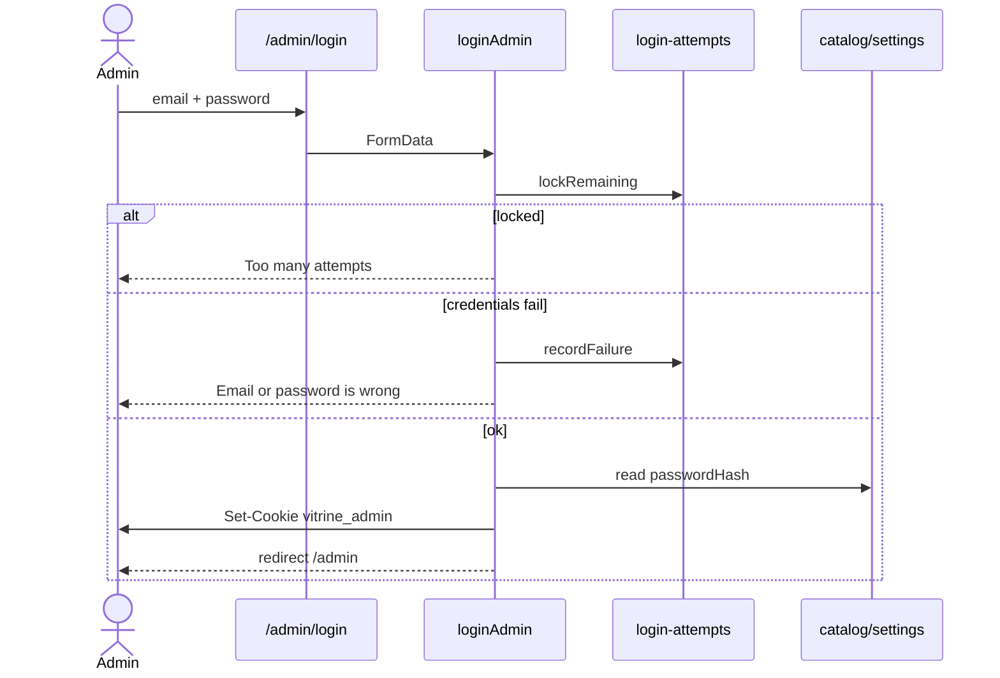

# Auth setup

Only one account exists: the email in `ADMIN_EMAIL`. There is no public sign-up.

## Sign-in

1. `GET /admin/login` — if a valid session cookie exists, redirect to `/admin`
2. `loginAdmin` (server action) validates email + password (client and server share [`lib/admin-validation.ts`](../lib/admin-validation.ts))
3. Lockout check: email **and** hashed client IP, 5 failures → 15 minutes ([`lib/login-attempts.ts`](../lib/login-attempts.ts))
4. `verifyCredentials`: stored `passwordHash` in settings, else the env password
5. Set `vitrine_admin` cookie (httpOnly, sameSite=strict, secure in production, 7 days)
6. Redirect to `/admin`

## Session

The cookie payload is `{ email, exp, pv }` HMAC-signed with `ADMIN_SESSION_SECRET`.

`pv` is a fingerprint of the **current** password (hash if set, else env). Changing the password changes `pv`, so every other device is signed out. The browser that just changed it gets a fresh cookie.

Protected routes live under `app/admin/(desk)/`. `requireAdmin()` redirects to `/admin/login` when the cookie is missing, expired, tampered, or the version no longer matches.

## Password rules

- 8–128 characters
- At least one letter and one number
- New password must differ from the current one
- Confirm must match

After a successful change, the env `ADMIN_PASSWORD` no longer works until settings lose `passwordHash` (there is no UI for that).

## What testers should prove

See [TESTING.md](./TESTING.md). Minimum:

- Unauthenticated `/admin`, `/admin/new`, `/admin/settings` → login
- Wrong password does not say which field is wrong
- Five bad attempts lock that client
- Password change keeps this session, drops another browser
- Tampered cookie is ignored
