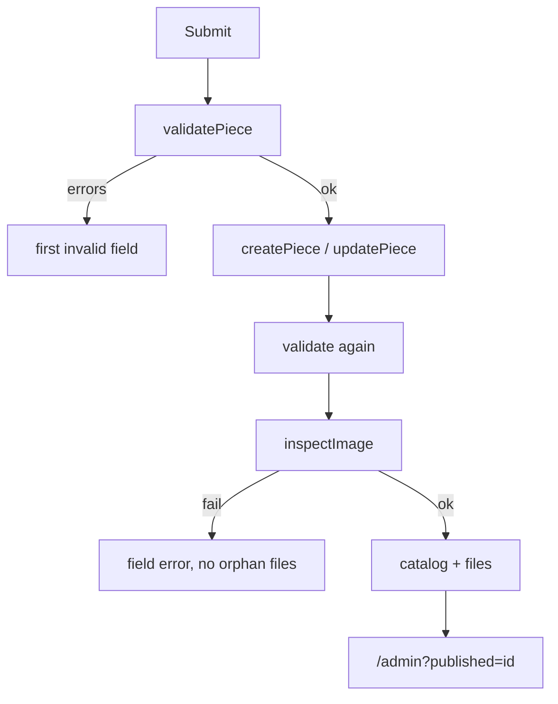

# Desk module

Signed-in catalog. Code: `app/admin/`, `components/admin/`. Logic: `lib/admin.ts`, `lib/piece.ts`, `lib/uploads.ts`.

Auth details: [AUTH_SETUP.md](./AUTH_SETUP.md).

## Routes

| URL | Guard | Purpose |
| --- | --- | --- |
| `/admin/login` | Guest (else redirect) | Sign in |
| `/admin` | `requireAdmin` | Pieces table |
| `/admin/new` | same | Publish |
| `/admin/[id]/edit` | same | Edit / delete |
| `/admin/settings` | same | Seed + password |

`app/admin/(desk)/layout.tsx` is the shell (logo, nav, email, sign out). Login is **outside** that group so it has no desk chrome.

## Pieces table

- Category chips (same labels as the gallery)
- Search `?q=` (title / designer)
- Columns: thumb, title + `/posts/id`, category, handle, added, Live/Featured, View/Edit
- Empty: `EmptyShelf` + “Upload one”
- After redirect: green `Notice` (`published` / `updated` / `removed`), then the flag is stripped from the URL without a server re-render

## Piece form

Shared by new and edit. Client validates with `validatePiece`; server re-validates and inspects bytes.

| Field | Rules |
| --- | --- |
| Category | One of `CATEGORIES` |
| Title | Required, ≤ 80 |
| Description | Required, ≤ 300 |
| Original URL | Empty **or** `http(s):` |
| Handle | Required, letters/numbers/`.` `_` `-`, `@` stripped |
| Avatar | Optional raster |
| Artwork | Required on create; JPG/PNG/WebP/GIF ≤ 8 MB |
| Frames | Integer 1–99; 1 hides the gallery badge |
| Featured | Checkbox |

Id is `slugify(title)` plus `-2`, `-3`… if taken. `publishedAt` is set on create and kept on edit.

Artwork is never trusted from the browser: `image-size` reads the header; declared MIME must match; SVG is refused.

## Settings

- **Seed archive** — `showSeed`. Off (default) = public gallery is only desk uploads.
- **Password** — see [AUTH_SETUP.md](./AUTH_SETUP.md). Form resets on success.

## Visual contract

White fieldsets, shared `FIELD` / `LABEL` / `HINT` from `components/admin/form.tsx`. Active desk nav has an ink underline. Mobile gets a second nav strip under the header.
