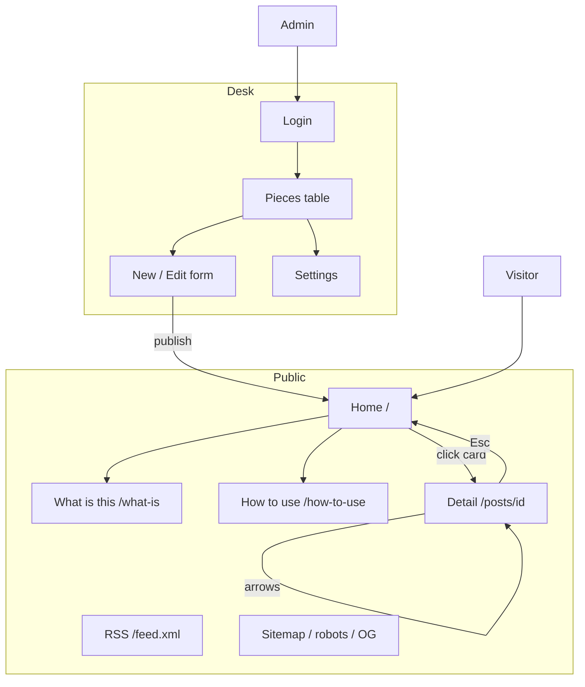
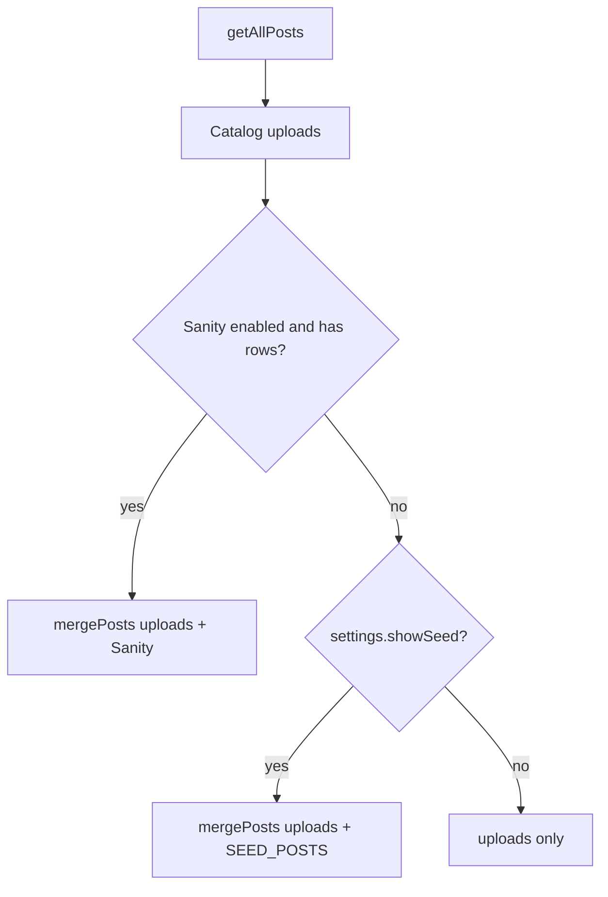
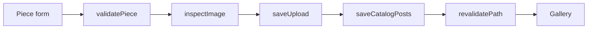

# Features

Every user-visible capability. If you ship a change, tick or edit the row **and** keep the diagram honest.

Module docs: [GALLERY](./GALLERY.md) · [DESK](./DESK.md) · [STORAGE](./STORAGE.md) · [API_REFERENCE](./API_REFERENCE.md)

## Map

## Public gallery

| ID | Feature | How to see it | Notes |
| --- | --- | --- | --- |
| G1 | Masthead | `/` | Split hero: eyebrow, “Design worth keeping.”, editorial stills |
| G2 | Category chips + counts | Filter bar | Clean paths: `/web`, `/branding`, … |
| G3 | Sort Latest / Featured | Sort control | `/featured` or `?sort=Featured` in a shelf |
| G4 | Search | Header field or `?q=` | All words must match; `/` focuses |
| G5 | Card grid | Feed | 3:2 cover, equal-height listings |
| G6 | Infinite scroll | Scroll | 16 per page |
| G7 | Title + description | Always on the card | Montserrat title; thumbs switch the cover crop |
| G8 | Featured / frames / designer | Card meta | Featured pill; avatar + handle; frames only if `slides > 1` |
| G9 | Empty shelf | No matches / empty catalog | Dashed case illustration |
| G10 | Footer | `/`, `/what-is`, `/how-to-use` | Categories, guides, RSS. No desk link |
| G11 | Loading skeleton | Slow network on `/` | Pulse, not shimmer |
| G12 | Error boundary | Forced render error | “The case would not open.” |
| G13 | What is this | `/what-is` | What the archive is, where pieces come from |
| G14 | How to use | `/how-to-use` | Browse in four steps, publish in four more |

## Detail

| ID | Feature | How to see it |
| --- | --- | --- |
| D1 | Artwork on canvas | `/posts/[id]` |
| D2 | Lightbox | Click artwork; Esc closes lightbox first |
| D3 | Header + back | Sticky header; panel “Gallery”; keys Esc ← → |
| D4 | Category chip | Links to filtered gallery |
| D5 | Featured pip | Only if `featured` |
| D6 | Metadata table | Designer, added, frames (if >1), size |
| D7 | View the original | Hidden when `sourceUrl` empty |
| D8 | Share / copy URL | Native share, else clipboard |
| D9 | Related in category | Up to 3; “See all” |
| D10 | 404 | Unknown id — “This piece has left the case.” |
| D11 | Concept band | Dark block under the piece; desk field, else description |

## Desk

| ID | Feature | How to see it |
| --- | --- | --- |
| A1 | Login + show password | `/admin/login` |
| A2 | Field validation | Empty/malformed submit |
| A3 | Lockout | 5 failures / 15 min |
| A4 | Session cookie | Survives reload; dies on tamper |
| A5 | Pieces table | Search, category chips, status |
| A6 | Publish | `/admin/new` |
| A7 | Edit + replace files | `/admin/[id]/edit` |
| A8 | Delete | Confirm dialog |
| A9 | Client image preview | Drop / choose artwork |
| A10 | Server image inspect | Real type + pixel size; no SVG |
| A11 | Notices | After publish / save / remove |
| A12 | Seed toggle | Settings |
| A13 | Change password | Settings; other devices signed out |
| A14 | Sign out | Desk header |

## Platform

| ID | Feature | Route / file |
| --- | --- | --- |
| P1 | RSS | `/feed.xml` |
| P2 | Sitemap | `/sitemap.xml` |
| P3 | Robots | `/robots.txt` — disallow `/admin` |
| P4 | Favicon | `/icon.svg` + `/apple-icon` |
| P5 | Open Graph | `/opengraph-image` + per-piece metadata |
| P6 | Local upload stream | `/uploads/[name]` |
| P7 | Sanity revalidate | `POST /api/revalidate` |
| P8 | CI | GitHub Actions |

## Content resolution

## Publish path

