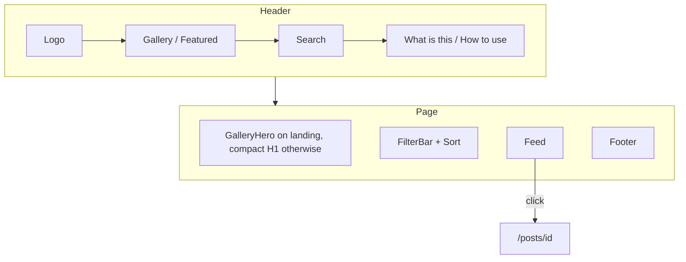

# Gallery module

Public archive. Code: `app/(gallery)/`, `app/posts/[id]/`, `components/{Header,GalleryHero,Feed,FilterBar,PostCard,PostPanel,Artwork,ConceptBand,Footer}`. Logic: `lib/posts.ts`, `lib/gallery-url.ts`.

## Routes

| URL | Behaviour |
| --- | --- |
| `/` | Home (All · Latest) |
| `/web`, `/branding`, `/product`, `/motion`, `/illustration`, `/3d`, `/print` | Indexable category shelves |
| `/featured` | Featured shelf |
| `/?q=ledger` or `/web?q=ledger` | AND-search — `noindex, follow` |
| `/web?sort=Featured` | In-shelf featured sort — `noindex, follow` |
| `/posts/[id]` | Detail. Unknown id → 404 |
| `/what-is` | What the archive is |
| `/how-to-use` | Browse and publish tutorial |
| `/feed.xml` | RSS 2.0, newest 50 |

Old `/?category=Web` and `/?sort=Featured` URLs 308 to the clean shelves. Search stays on the query string and is not indexed.

Landing (`/`, All, Latest, no `q`) uses `GalleryHero`: type left, live stills right. Search, category and Featured drop to a compact H1.

## Screen map

## Search

- GET form, works before hydration.
- Category and sort ride as hidden fields.
- `/` focuses the field when the target is not already an input.
- Clear is a `Link` that drops `q`.
- Chip counts recompute against the current `q`.

## Card grid

`.feed-grid` is a regular 2 / 3 / 4 column grid. Cards stretch to the row height. Infinite scroll: IntersectionObserver + throttled scroll, 16 cards, `card-in` on later pages.

Each card matches the Uiverse Design listing: 3:2 cover, preview thumbs, Montserrat title, two-line description, then category / avatar + handle / frames. Featured is a small rust pill, not a price.

## Detail keys

| Key | Action |
| --- | --- |
| Esc | Close lightbox if open, else back to `/` |
| ← / → | Neighbour piece (Latest order of the full catalog) |

The gallery header stays on the piece: logo and **Gallery** return home. The panel also has a labelled Gallery control (no longer an unlabeled X).

## Empty and error

- Empty catalog: “The archive is empty”
- Empty filter/search: “Nothing on this shelf” + “Show everything”
- `app/error.tsx`: try again / back to gallery
- `app/not-found.tsx`: “This piece has left the case.”

## Visual contract

Match [DESIGN_SYSTEM.md](./DESIGN_SYSTEM.md) and [VISUAL_GUIDE.md](./VISUAL_GUIDE.md). Header search is a pill; chips are pills with tabular counts; footer sits only on `/`. No Admin link in the header or footer.
