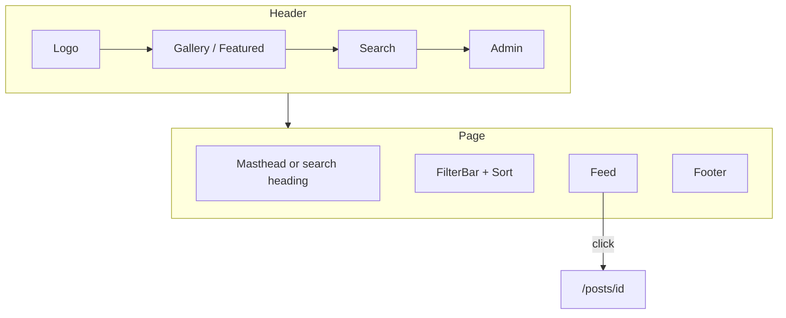

# Gallery module

Public archive. Code: `app/(gallery)/`, `app/posts/[id]/`, `components/{Header,Feed,FilterBar,PostCard,PostPanel,Artwork,Footer}`. Logic: `lib/posts.ts`, `lib/gallery-url.ts`.

## Routes

| URL | Behaviour |
| --- | --- |
| `/` | Home. Query: `category`, `sort`, `q` |
| `/?category=Web` | Chip filter |
| `/?sort=Featured` | Featured first, then newest |
| `/?q=ledger` | AND-search on title, description, handle, category |
| `/posts/[id]` | Detail. Unknown id → 404 |
| `/feed.xml` | RSS 2.0, newest 50 |

Canonical URLs omit defaults (`All`, `Latest`, empty `q`) so `/` stays short. Filtered/search views are `noindex, follow`.

## Screen map

## Search

- GET form, works before hydration.
- Category and sort ride as hidden fields.
- `/` focuses the field when the target is not already an input.
- Clear is a `Link` that drops `q`.
- Chip counts recompute against the current `q`.

## Masonry

`.feed-grid` uses 4px implicit rows. Each article gets `grid-row-end: span N` from measured height + column gap. Re-layout on **width** only (height would loop). Infinite scroll: IntersectionObserver + throttled scroll, 16 cards, `card-in` on later pages.

## Detail keys

| Key | Action |
| --- | --- |
| Esc | Close lightbox if open, else back to `/` |
| ← / → | Neighbour piece (Latest order of the full catalog) |

## Empty and error

- Empty catalog: “The archive is empty”
- Empty filter/search: “Nothing on this shelf” + “Show everything”
- `app/error.tsx`: try again / back to gallery
- `app/not-found.tsx`: “This piece has left the case.”

## Visual contract

Match [DESIGN_SYSTEM.md](./DESIGN_SYSTEM.md) and [VISUAL_GUIDE.md](./VISUAL_GUIDE.md). Header search is a pill; chips are pills with tabular counts; footer sits only on `/`.
