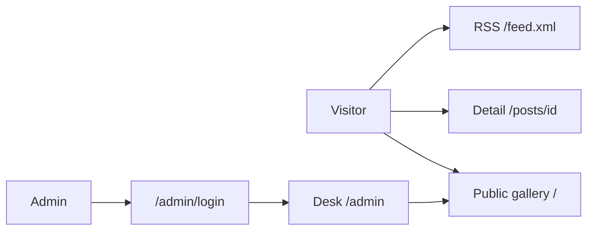
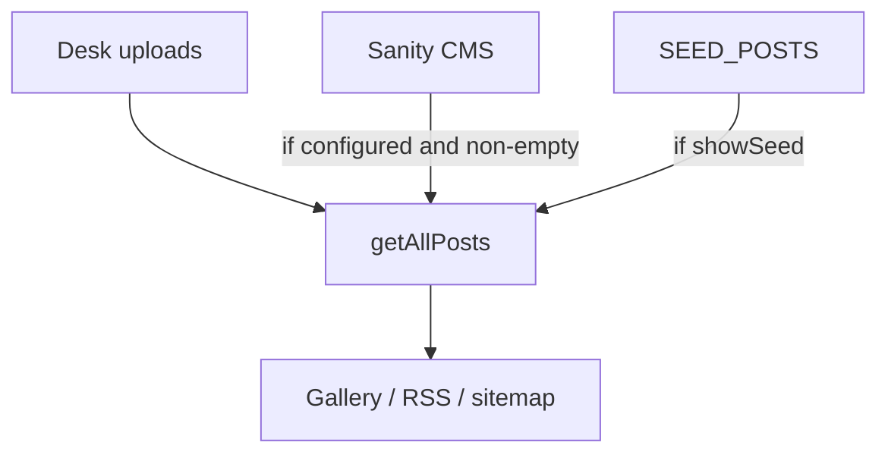

# Project summary

**Spiffing** is a curated design archive: a public listing gallery and a private desk for publishing pieces. One Next.js App Router app, Tailwind CSS, deployable on Vercel.

Live: [https://vitrine-fawn.vercel.app](https://vitrine-fawn.vercel.app)

## What it is not

- Not a multi-user CMS. One admin, signed in with env credentials (later a hashed password in settings).
- Not Clerk. Public “Join / Sign in” was removed; visitors browse, the desk publishes.
- Not a copy of inspora.design. Same *kind* of site (archive + listing cards), own name, mark, palette and copy.

## Two surfaces



| Surface | Who | Can do |
| --- | --- | --- |
| Gallery | Anyone | Browse, filter, search, open a piece, share, read RSS |
| Desk | The configured admin | Publish, edit, delete, toggle seed, change password |

## Content pipeline

Uploads from the desk sit in front. Sanity is optional. The shipped seed archive appears unless Settings → show seed is turned off (default **on**, with at least two pieces in every category).



## Stack

| Layer | Choice |
| --- | --- |
| App | Next.js 16 App Router, React 19 |
| Style | Tailwind 4, Inter + Montserrat, paper palette |
| Auth | Signed httpOnly cookie, scrypt hash |
| Data | `data/*.json` locally; private Vercel Blob in production |
| Images | Public Blob URLs on Vercel; `/uploads/[name]` locally |
| Tests | Vitest (unit/integration), Playwright (e2e), GitHub Actions |

## Repo map

```
app/(gallery)/     public home
app/posts/[id]/    detail viewer
app/admin/         login + protected desk
app/feed.xml/      RSS
app/uploads/       local upload stream
lib/               domain logic (no UI)
components/        gallery + desk UI
docs/              this documentation
tests/             vitest + playwright
```
