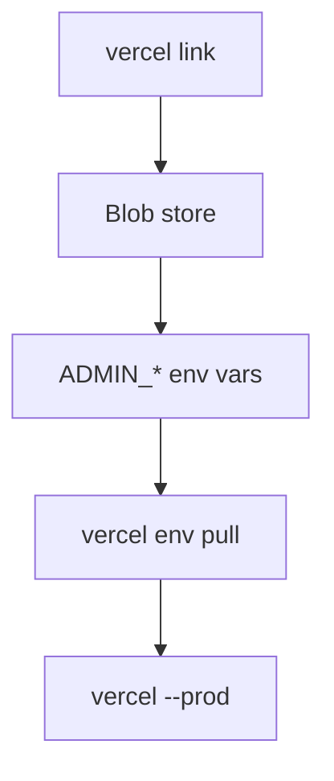

# Setup guide

## Local

1. Copy `.env.example` → `.env.local` and fill the [TODO](./TODO_BEFORE_RUNNING.md).
2. `npm install && npm run dev`
3. Gallery: `http://localhost:3000`
4. Desk: `http://localhost:3000/admin`

Local catalog lives in `data/` (`catalog.json`, `settings.json`, `login-attempts.json`, `uploads/`). That folder is gitignored.

## Vercel (required to keep uploads on the live site)

1. `vercel link`
2. `vercel blob create-store spiffing --access public --yes` (once)
3. Set `ADMIN_EMAIL`, `ADMIN_PASSWORD`, `ADMIN_SESSION_SECRET` for all environments (`vercel env add`)
4. `vercel env pull .env.local --yes`
5. `vercel --prod`

Blob injects `BLOB_READ_WRITE_TOKEN`. Catalog, settings and the lockout ledger are **private** blobs. Artwork is **public** so the gallery `` tags work.

If Blob is missing, `/admin` still writes to disk. That is fine on a laptop and **gone** after each serverless deploy.

## GitHub → Vercel

The project can be git-connected. Pushing `main` runs [`.github/workflows/ci.yml`](../.github/workflows/ci.yml) (typecheck, lint, unit, then e2e) and can trigger a Vercel deploy.

## Sanity (optional)

The gallery does not need Sanity. If you want `/studio`:

1. Create a project at sanity.io/manage
2. Set `NEXT_PUBLIC_SANITY_PROJECT_ID`, `NEXT_PUBLIC_SANITY_DATASET`, `NEXT_PUBLIC_SANITY_API_VERSION`
3. CORS: `http://localhost:3333` and the Vercel domain
4. Webhook: `https://<domain>/api/revalidate` with `SANITY_REVALIDATE_SECRET`

Desk uploads still win when both exist (`mergePosts`).

## Environment reference

| Variable | Required | Notes |
| --- | --- | --- |
| `ADMIN_EMAIL` | Desk | Lowercased; must look like an email |
| `ADMIN_PASSWORD` | Desk | Min 8; ignored after a password change in Settings |
| `ADMIN_SESSION_SECRET` | Desk | Min 16; HMAC for the cookie |
| `SESSION_COOKIE_SECURE` | No | Set `false` only to test production mode over HTTP |
| `BLOB_READ_WRITE_TOKEN` | Live uploads | Injected by Vercel Blob |
| `NEXT_PUBLIC_SITE_URL` | SEO | Else `VERCEL_PROJECT_PRODUCTION_URL` / localhost |
| `NEXT_PUBLIC_SANITY_*` | Studio | Leave empty to skip CMS |
| `SANITY_REVALIDATE_SECRET` | Webhook | Must match Sanity |
| `DATA_DIR` | Tests | Vitest/Playwright point this at a temp folder |

Full template: [`.env.example`](../.env.example).
