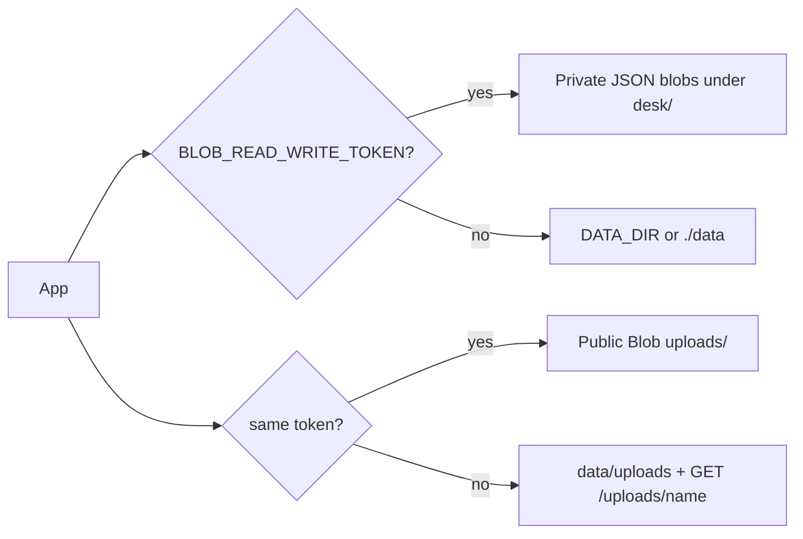

# Storage module

Where catalog, settings, lockouts and files live. Code: `lib/store.ts`, `lib/catalog.ts`, `lib/settings.ts`, `lib/login-attempts.ts`, `lib/uploads.ts`, `app/uploads/[name]/route.ts`.

## Switch



`blobEnabled` is simply `Boolean(process.env.BLOB_READ_WRITE_TOKEN)`. Tests and Playwright set the token to `""` so they never touch the live store.

## JSON documents

| File | Private? | Shape |
| --- | --- | --- |
| `catalog.json` | yes | `Post[]` (malformed rows dropped) |
| `settings.json` | yes | `{ showSeed, passwordHash? }` |
| `login-attempts.json` | yes | keyed by `email:` and hashed `ip:` |

On Vercel these are `desk/<name>` with `access: "private"`. First read still migrates the old public `catalog/` prefix and deletes it.

Local writes are atomic (`*.tmp` then rename).

## Uploads

- Allowed: JPEG, PNG, WebP, GIF. Max 8 MB. No SVG.
- Name: `{prefix}-{timestamp}.{ext}`
- Production: public Blob URL (`*.blob.vercel-storage.com`)
- Local: `/uploads/{name}` streamed from `data/uploads` — **not** `public/uploads`. Next.js 16 only serves `public/` files that existed at build time, so runtime files in `public/` 404.

`removeUpload` only deletes own Blob URLs (hostname + `/uploads/` path) or a safe local basename. Seed art and foreign URLs are ignored.

## Piece record

```ts
type Post = {
  id: string
  title: string
  description: string
  category: Category  // Web | Branding | Product | Motion | Illustration | 3D | Print
  creator: { handle: string; avatar: string }
  media: { src: string; width: number; height: number }
  slides: number
  sourceUrl: string   // "" hides the button
  featured: boolean
  publishedAt: string // ISO
}
```

Default avatar when none is uploaded: `/creators/creator-1.svg`.
